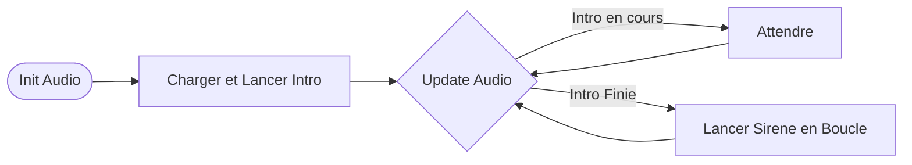

```mermaid
flowchart LR
    Start([Init Audio]) --> Intro[Charger et Lancer Intro]
    Intro --> Update{Update Audio}
    
    Update -- "Intro en cours" --> Wait[Attendre]
    Update -- "Intro Finie" --> Loop[Lancer Sirene en Boucle]
    
    Wait --> Update
    Loop --> Update
```