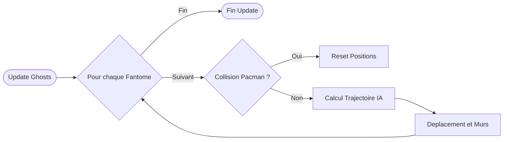

```mermaid
flowchart LR
    Start([Update Ghosts]) --> Loop{Pour chaque Fantome}
    
    Loop -- Fin --> End([Fin Update])
    Loop -- Suivant --> Col{Collision Pacman ?}
    
    Col -- Oui --> Kill[Reset Positions]
    Col -- Non --> IA[Calcul Trajectoire IA]
    
    IA --> Move[Deplacement et Murs]
    Move --> Loop
```