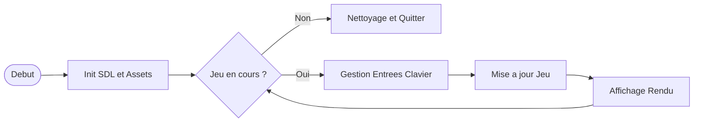

```mermaid
flowchart LR

    Start([Debut]) --> Init[Init SDL et Assets]
    Init --> Boucle{Jeu en cours ?}
    
    Boucle -- Non --> Fin[Nettoyage et Quitter]
    
    Boucle -- Oui --> Event[Gestion Entrees Clavier]
    Event --> Update[Mise a jour Jeu]
    Update --> Draw[Affichage Rendu]
    
    Draw --> Boucle
```