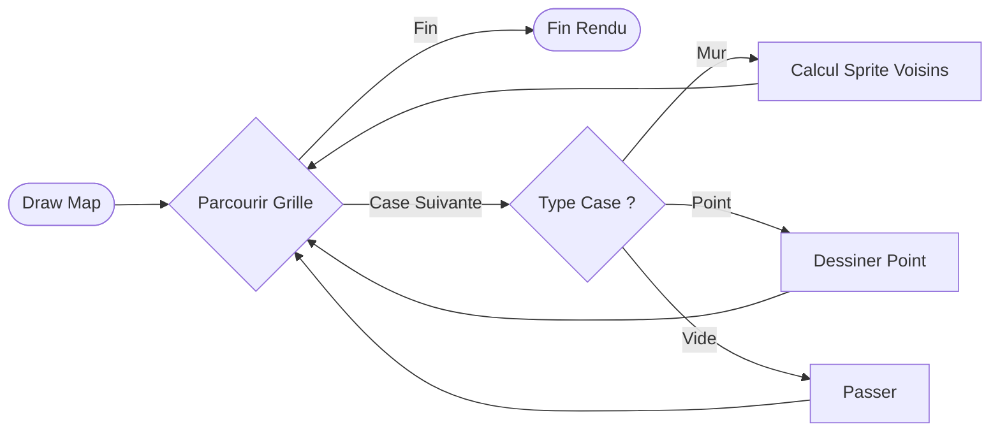

```mermaid
flowchart LR
    Start([Draw Map]) --> Loop{Parcourir Grille}
    
    Loop -- Fin --> End([Fin Rendu])
    Loop -- Case Suivante --> Check{Type Case ?}
    
    Check -- Mur --> Wall[Calcul Sprite Voisins]
    Check -- Point --> Dot[Dessiner Point]
    Check -- Vide --> Skip[Passer]
    
    Wall & Dot & Skip --> Loop
```